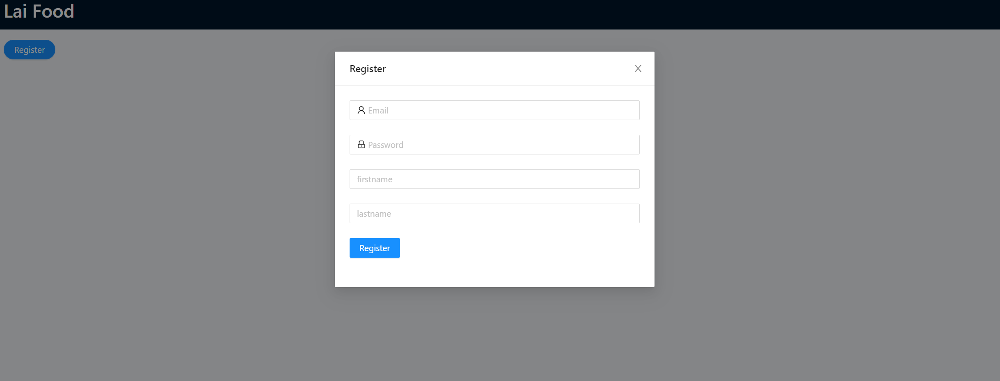
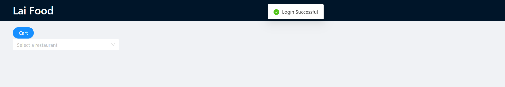
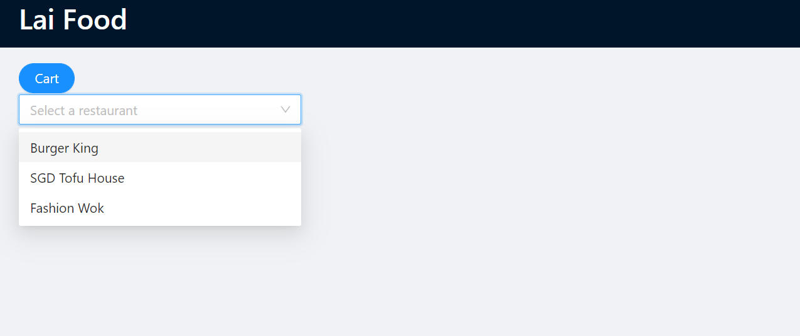
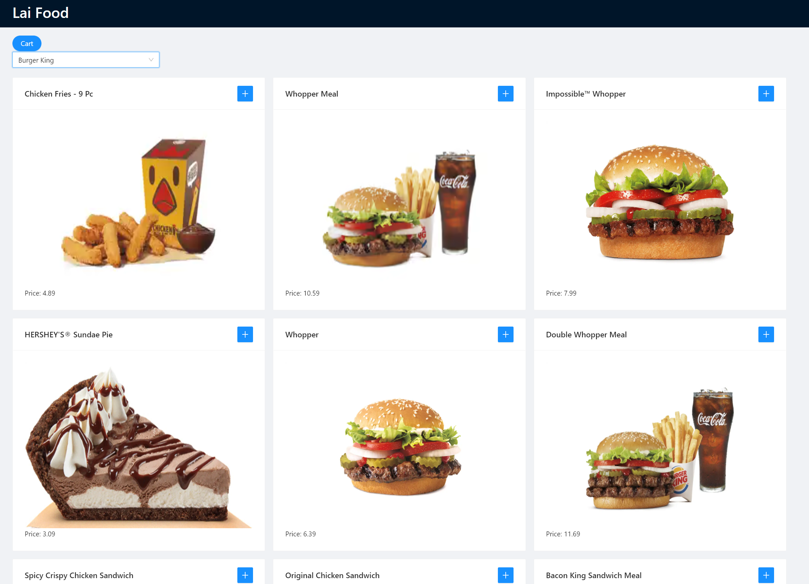
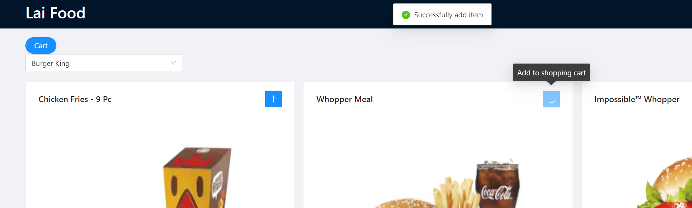
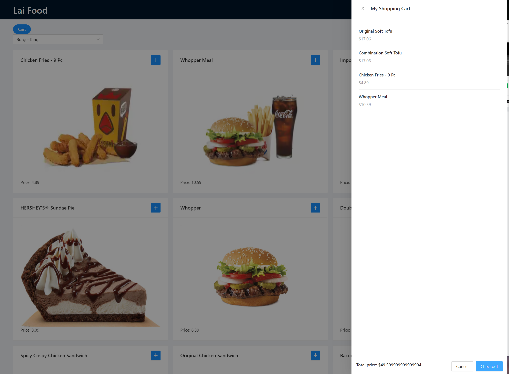

# FoodDash

This is a Spring-based web application, an online food order website.

It's deployed on my AWS EC2 server and can be accessed through the [link](http://54.86.213.235/).

The [frontend](foodDash-web-frontend) is based on React and ANT design.

The [backend](foodDash-backend) is implemented with Java Spring framework and Hibernate, with AWS MySQL database and Hibernate Session Factory security.

# Frontend Features

## Development Setup

Clone the [frontend repo](foodDash-web-frontend), install JavaScript runtime environment [nodeJS](https://nodejs.org/en/)

```java
//npm install required libraries from package.json if needed
npm start
```

## Homepage


## Signup



## Login Successful



## Select Restaurants



## Menu




## Order To Cart



## Cart And Check Out




# [Backend](foodDash-backend)

## Spring MVC Framework  + Hibernate ORM 

```
Controller:
1:CartController
2:CheckoutController
3.ItemOrderController
4.MenuInfoController
5.SigninController
6.SingupController
```

```
Data Access Object:
1:CartDao
2.CustomerDao
3.MenInfoDao
4.OrderItemDao
```

```
Table Entities BY HIbernate
1.Authorities
2.Cart
3.Customer
4.MenuItem
5.OrderItem
6.Restaurant
```

```
Service:
1.CartServiceService
2.CustomerService
3.MenuInfoService 
4.OrderItemService 
```

## Security

Hibernate Session Factory

## Database and Instance

AWS MYSQL database + AWS EC2