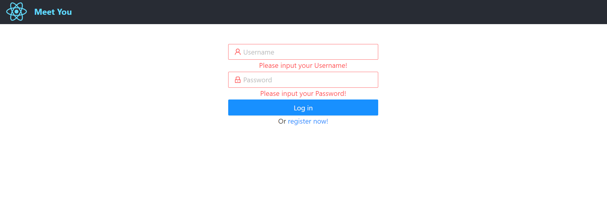
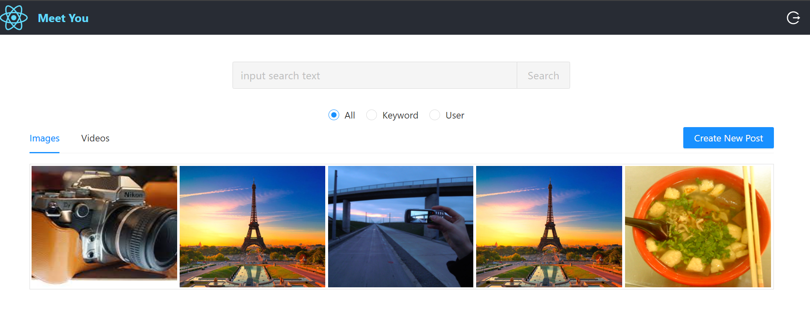
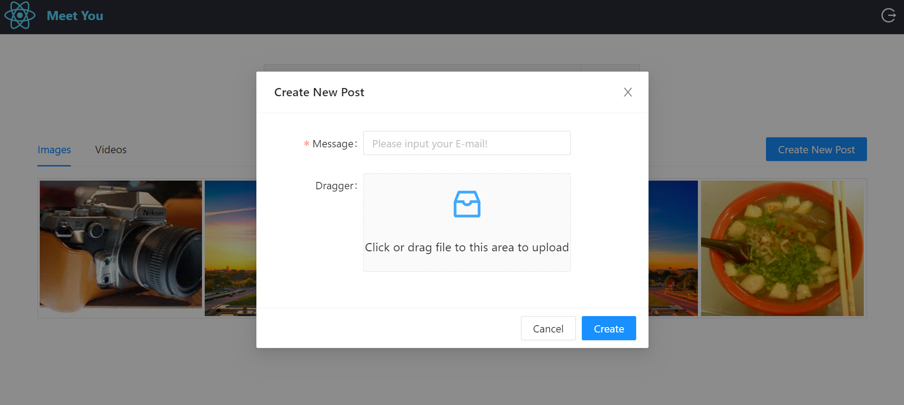
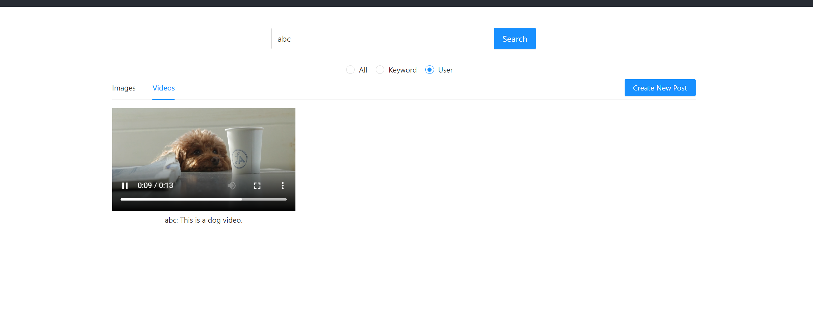
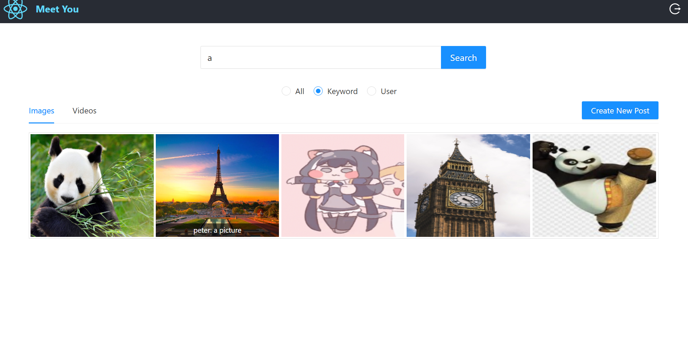
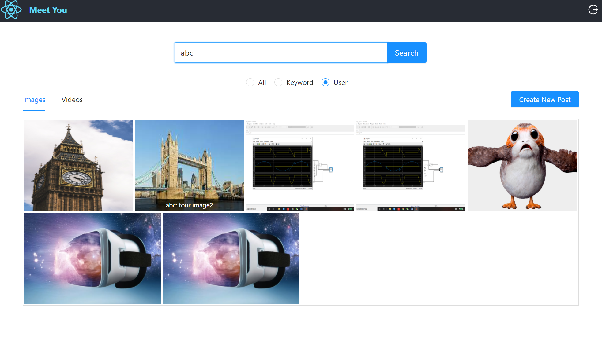

# MeetYou	

This is a Go web service based social network web application with React JS.

It's deployed on my Google App Engine server and can be accessed through the [link](http://35.192.53.45:9200).

The [frontend](MeetYou-web-frontend) is based on React and ANT design.

The [backend](MeetYou-backend) is implemented with Go web service, and deployed on google cloud compute engine with Elasticsearch database, Token based authentication with JSON Web Token.

# Frontend Features

## Development Setup

Clone the [frontend repo](MeetYou-web-frontend), install JavaScript runtime environment [nodeJS](https://nodejs.org/en/)

```java
//npm install required libraries from package.json if needed
npm start
```

## Login



## Main Page(User Page)



## Upload (image/video)



## Open Image Content


## Delete Image Content


## Open Video Content




## Search Content Based On Keywords 



## Search Content Based On User 



## User Log Out


# [Backend](MeetYou-backend)

## Go Web Service 

```
Backend:
1:elasticsearch.go     //elasticsearch database
2:gcs.go               //goold cloud storage
```

```
Conf:
depploy.yml
```

```
constants
1.constants.go
```

```
handler:
1.post.go
2.router.go
3.user.go
```

```
model:
1.model.go
```

```
service:
1:post.go
2.user.go
```

```
utils:
1.yaml.go
```


## Security

Token based authentication with JSON Web Token

## Database and Instance

Google Compute Engine(GCE):  Elasticsearch