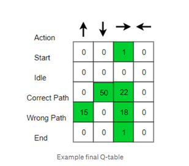
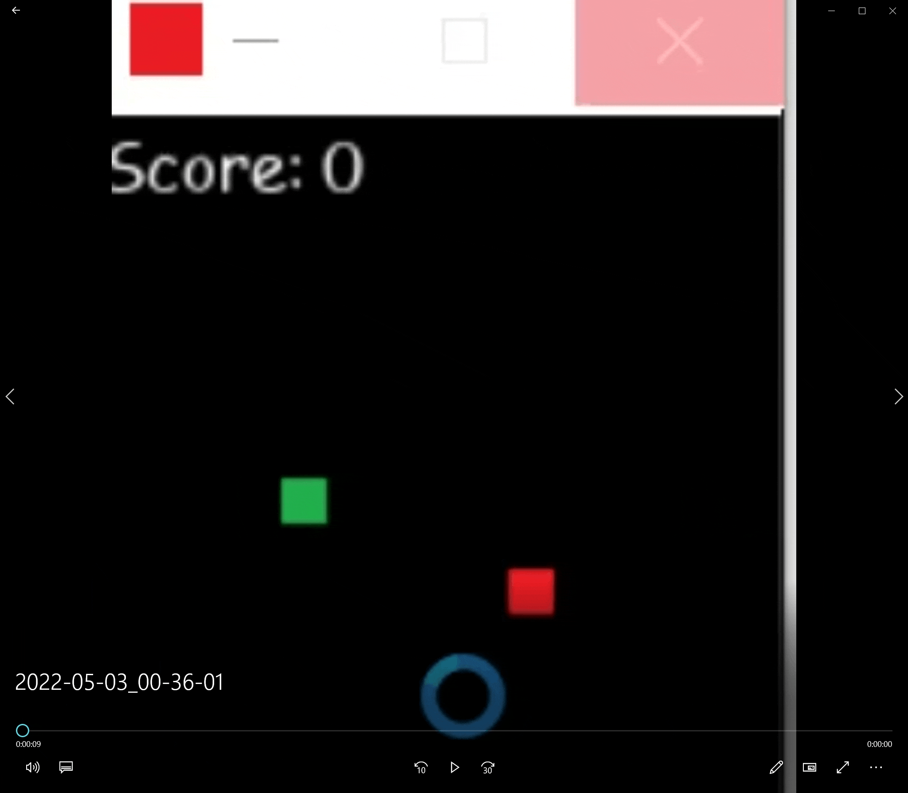

AI term project: Learn how to play the snake game
================================

The solution uses Reinforcement Learning (Q-learning) approach.

Q-formula:
------ 

Introduction of Q learning
------ 
* Observation of the environment
* Deciding how to act using some strategy
* Acting accordingly
* Receiving a reward or penalty
* Learning from the experiences and refining our strategy

Input
---------
- The Q matrix is initially filled with 0s
- The Q table updated every time that the agent makes the move and looks like an example below:
-

Training phase and output
---------
- The agent will choose either max Q value or a random action.
- The process is iterated until the game is finished.
- The Q matrix is updated with games that have totally played.

Reward table
------------

- +1 for finding red dot target
- -1 for hitting wall or tail

Parameter settings
----------------

Param | Value | Info
--- | --- | ---
LEARNING_RATE | 0.05 |
GAMMA | 0.80 | Discount rate
EPSILON | 0.10 | Exploration rate

Result
-------------
Agent is following shortest path towards goal after training using the most updated Q table.

------

