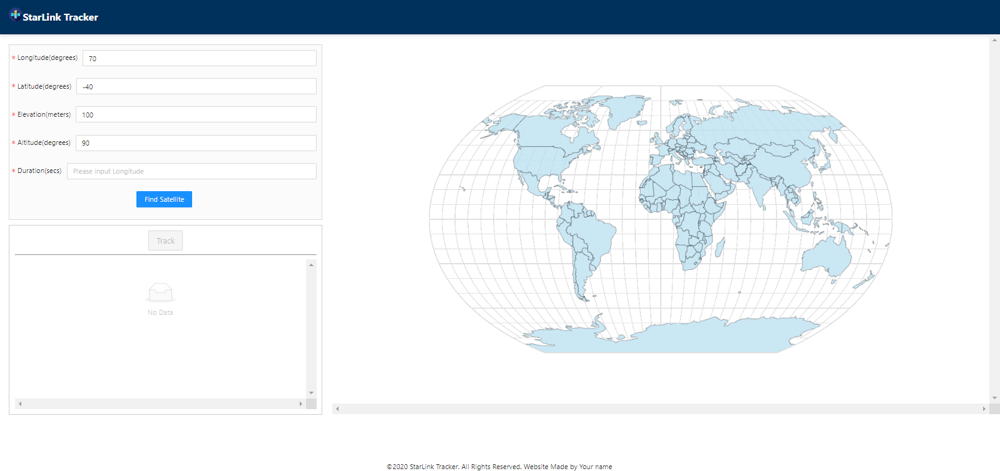
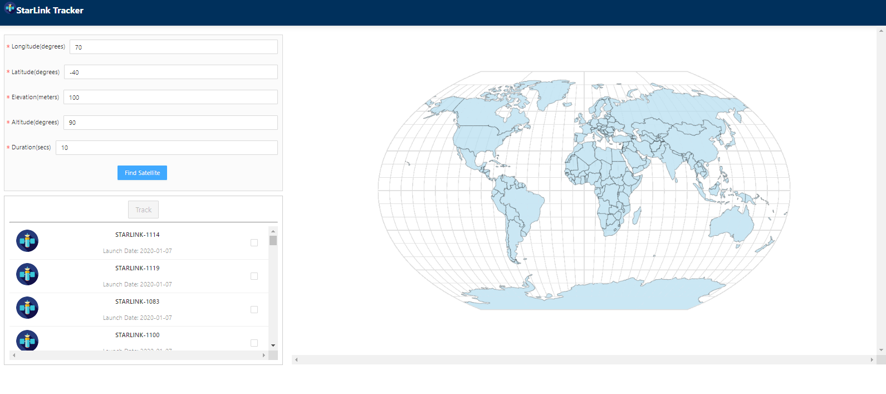
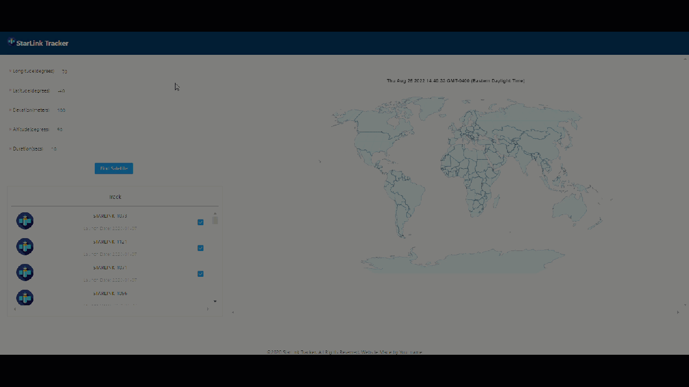

# StarLink	

This is a starLink satellites track application with React JS.

It's using [N2YO](https://www.n2yo.com/) provided APIs to query data from its backend.

The [frontend](MeetYou-web-frontend) is based on React, [ANT design](https://ant.design/docs/react/introduce) and [d3-geo](https://github.com/d3/d3-geo) Map projections. 

# Frontend Features

## Development Setup

Clone the [frontend repo](StarLink-web-frontend), install JavaScript runtime environment [nodeJS](https://nodejs.org/en/)

Register your [Satellite API KEY](https://www.n2yo.com/) to access data and switch the key to yours in constants.js

```java
//npm install required libraries from package.json if needed
npm start
```

## Interface



## Find Satellite



## Tracking GIF



