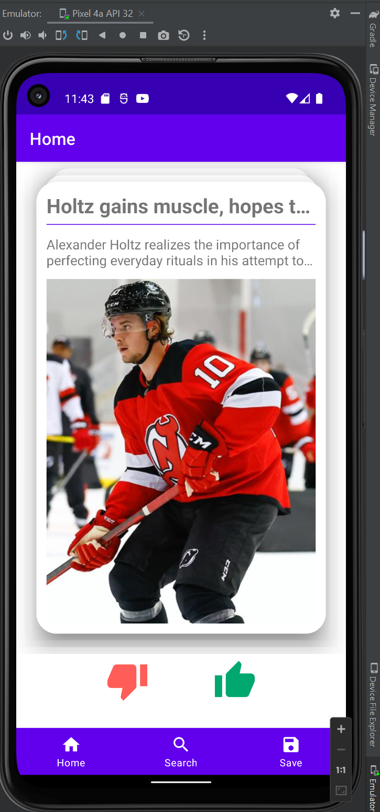

# SwipeNews

This is a tinder style news android application with MVVM architecture in [Jetpack](https://developer.android.com/jetpack).

Using Retrofit networking to query data from [NewsAPI](https://newsapi.org) provided APIs.

Swiping news with [CardStackView](https://github.com/yuyakaido/CardStackView)

Local Database is using Room in the Jetpack.

# Frontend Features

## Development Setup

Clone the [SwipeNews](SwipeNews), run it with android studio

Set environment: (1)At least *Android 12(S) and Android API 32*  (2) select an android *Pixel 5* 

Register [NewsAPI KEY](https://www.n2yo.com/) to access data and switch the key to yours in retrofitClient.java.

## Home

## Search

## Save Liked Article

## Swiping And Animation

